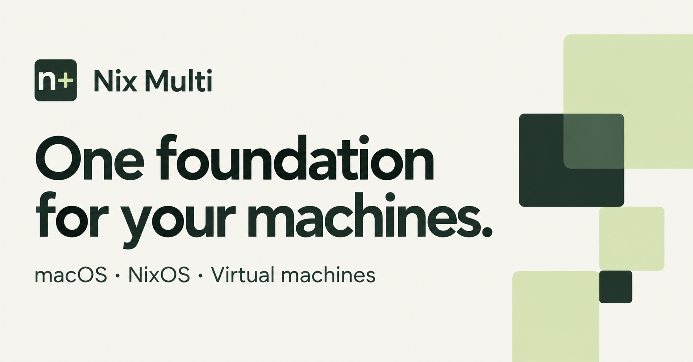

<p align="center">
  
</p>

<p align="center">
  <a href="#getting-started">Getting started</a> ·
  <a href="#choose-your-desktop">Desktop choices</a> ·
  <a href="#everyday-workflows">Workflows</a> ·
  <a href="website/README.md">Website & documentation</a>
</p>

# Your machines. Your workflow. One foundation.

An opinionated Nix configuration for macOS, NixOS desktops, and virtual machines.
Keep shared tools in reusable modules, personal choices in a profile, and your
setup in version control.

| A shared foundation | Room for your choices |
| --- | --- |
| **Repeatable environments** | Flakes pin dependencies; modules capture your configuration. |
| **Personal profiles** | Identity, locale, hardware, and host preferences stay together. |
| **Multiple platforms** | nix-darwin for macOS, NixOS for Linux, Home Manager for shared tools. |
| **Optional capabilities** | Development shells, VM management, Agenix secrets, and AI tooling. |

> **Make it yours before applying it.** This repository is actively used on the
> maintainer's machines. Replace personal values, hardware settings, SSH hosts,
> and encrypted secrets before activating a configuration.

## Choose your desktop

Each Linux output selects the desktop its name describes:

| Flake output | Desktop |
| --- | --- |
| `nixos-end4` | Hyprland with the end4 configuration |
| `nixos-omarchy` | Omarchy desktop through the NixOS integration |
| `nixos-plasma` | KDE Plasma 6 with SDDM and Plasma Home Manager settings |

The Linux setup default is defined near the top of the [Makefile](Makefile):

```makefile
LINUX_CONFIG ?= nixos-end4 # nixos-end4 | nixos-omarchy | nixos-plasma
```

Override it for a single invocation after completing setup:

```sh
CONFIRM_APPLY=1 make setup-linux LINUX_CONFIG=nixos-plasma
```

The three maintained desktop outputs share the same host name and hardware
profile. The `nixos-desktop` alias defaults to `nixos-omarchy`; its selection line
in [flake.nix](flake.nix) also lists all three choices. Older
`nixos-desktop-end4` and `nixos-desktop-omarchy` names remain compatibility aliases.
**`nixos-plasma` now means Plasma, not end4.**

| Other maintained output | Platform / environment |
| --- | --- |
| `Ryans-MacBook-Pro` | Apple Silicon macOS with nix-darwin |
| `vm`, `nixos-vm-omarchy` | x86_64 NixOS guest with Omarchy |
| `nixos-vm-hyprland` | x86_64 NixOS guest with end4 Hyprland |

These outputs use the maintainer's profile. Forks should define their own hosts.
The VM outputs declare x86_64, but the current maintainer VM hardware module
selects ARM64; Omarchy requires x86_64. This existing mismatch blocks the full
flake check. Generate hardware configuration for the intended guest before
using the VM profiles.

## Getting started

1. **Prepare Nix.** On macOS, review the [Determinate Nix Installer](https://github.com/DeterminateSystems/nix-installer).
   On NixOS, use the existing installation. Enable `nix-command` and `flakes`.
2. **Create a profile.** Copy [profiles/example.nix](profiles/example.nix) to your
   own profile and set your user name, email, locale, and host preferences.
3. **Describe your hardware.** On each NixOS target, run
   `sudo nixos-generate-config --show-hardware-config`. Save the output in your
   own hardware module and update the profile's `hardwareModules` paths.
4. **Connect your hosts.** Update the profile import and host outputs in
   [flake.nix](flake.nix). Replace the maintainer's host names, disks, GPU IDs,
   and SSH configuration. Set `machine` explicitly when reusing a machine
   module under a new host name.
5. **Create your secrets.** Base `secrets.nix` on
   [secrets.nix.example](secrets.nix.example), use your own public recipients,
   and create new encrypted files. See the [Agenix guide](secrets/README.md).
6. **Track and validate.** Review and add your configuration files to Git, then
   run `nix flake check` and build your selected host before activation.

`profiles/local.nix` and `profiles/local/` are ignored by Git. If you use those
paths, explicitly track reviewed configuration with `git add -f`, or choose
another profile name. Never track private keys or plaintext secrets.

After validation, apply **your own** output with the matching target:

```sh
# macOS — replace my-mac with your Darwin output
CONFIRM_APPLY=1 make setup-macos MACOS_CONFIG=my-mac

# NixOS — replace my-desktop with your NixOS output
CONFIRM_APPLY=1 make setup-linux LINUX_CONFIG=my-desktop
```

Activation installs packages and changes system settings. Keep a known working
generation available while trying changes.

## Everyday workflows

| Command | Purpose |
| --- | --- |
| `make help` | Discover available commands |
| `make check` | Evaluate flake checks |
| `make fmt` | Format Nix files |
| `make dev` | Enter the default development shell |
| `make dev-web` / `make dev-python` | Web or Python development |
| `make dev-flutter` / `make dev-rust` | Flutter or Rust development |
| `make vm-download` | Download the ARM64 UTM ISO without activating a system |

Review updates to `flake.lock` before rebuilding. VM, GPU, and libvirt workflows
are host-specific. `make clean` also runs Nix garbage collection.

## Inside the repository

```text
profiles/    Identity, preferences, hardware, and personal imports
machines/    Platform composition for macOS, desktops, and guests
modules/     Reusable system, desktop, host, and VM capabilities
home/        Shared and platform-specific Home Manager configuration
devshells/   Focused development environments
website/     Product website and practical documentation
```

## Explore further

- [Website development and GitHub Pages publishing](website/README.md)
- [Virtual machines and UTM](docs/VM-MANAGEMENT.md)
- [Agenix secret management](secrets/README.md)
- [GPU passthrough module](modules/hosts/linux/gpu-passthrough.nix)
- [AI agent workflow](docs/AI-AGENT-WORKFLOW.md)

Hardware, BIOS, GPU, and local-model notes contain maintainer-specific examples.
Adapt them to your own machine.

## Use and licensing

This configuration is provided for educational and personal use. Review the
modules before enabling them on a machine you rely on, and check the licenses
of included software separately.
